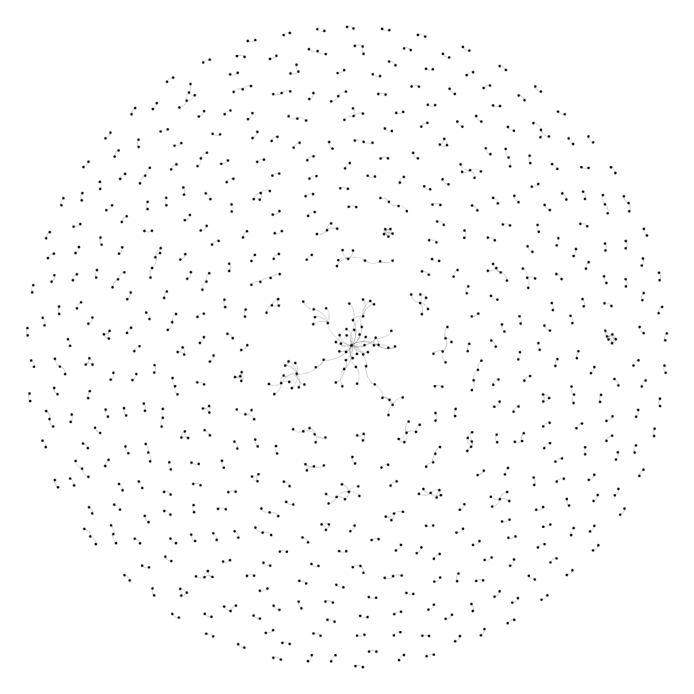

# [INST633](http://www.cs.umd.edu/~golbeck/INST633o/), Summer 2018
#### Instructor: Dr. Jennifer Golbeck
## Final
#### Network Analysis Team: Roberto Rubio, Aditya Bhat, Sigfried Gold, Siwei Zhang
### Documents

  - [Instructions](http://www.cs.umd.edu/~golbeck/INST633o/finalRoseanne.shtml)
  - [Working document](https://docs.google.com/document/d/1N4y6ackCArsl8Sn_i1T2Ew4_eMFUjb2qgm3V9sqvHNg)
  - Coding spreadsheet
    - [original](https://docs.google.com/spreadsheets/d/1YaLDTZkNrb7c05TSRsQb95IIxOw_hR1jGDM4xDuQEJY)
    - [Sigfried's copy, sorted by tweet date](https://docs.google.com/spreadsheets/d/1IFPaBT7qKkyT0xTE8ifGHfRiTHZbeYcImyHvTrHNvi0)
 
 
 Stats (from running [./counts.sh](https://github.com/Sigfried/INST633/blob/master/counts.sh))

    26,080 unique edge sources in gephi
     16,719 unique edge targets in gephi
     10,498 unique sources (Users) in coding spreadsheet
    
         0 occurrences of realDonaldTrump as User/sender in spreadsheet
         8 occurrences of @realDonaldTump as source in gephi edges
     1,176 occurrences of @realDonaldTump as target in gephi edges
         0 occurrences of AP as User/sender in spreadsheet
        42 occurrences of @AP as source in gephi edges
       108 occurrences of @AP as target in gephi edges
       
     3,321 unique @mentions in spreadsheet -- Not sure I trust this number, but if it’s correct, it’s a lot smaller than we’d expect

Both-way links ([count_sts.py](https://github.com/Sigfried/INST633/blob/master/count_sts.py)):

    ⇒  python count_sts.py | head
    Source,Target
    @Sw33tss_,@BruceHiscott
    @sueski93,@kplknup
    @birdieglad,@pannlewis44
    @Claudia28588043,@DaleEstey
    @ChelseaClinton,@therealroseanne
    @CityJohn,@HelenORahilly
    @DarbaDee,@mitch_won
    @DarbaDee,@vertigo7804
    @dmason8652,@1angryhillbilly
    ... (656 edges)

